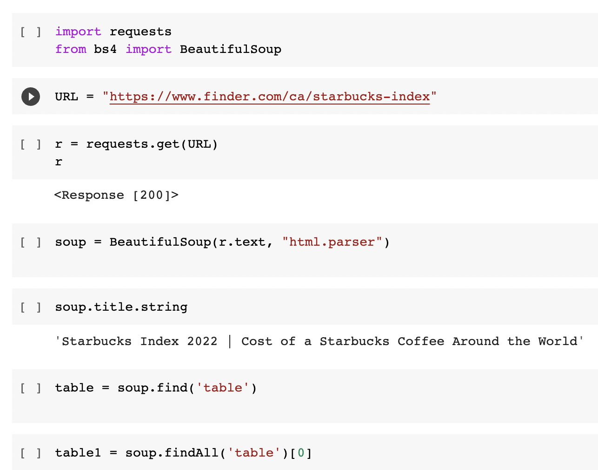
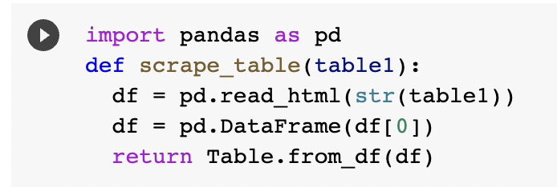
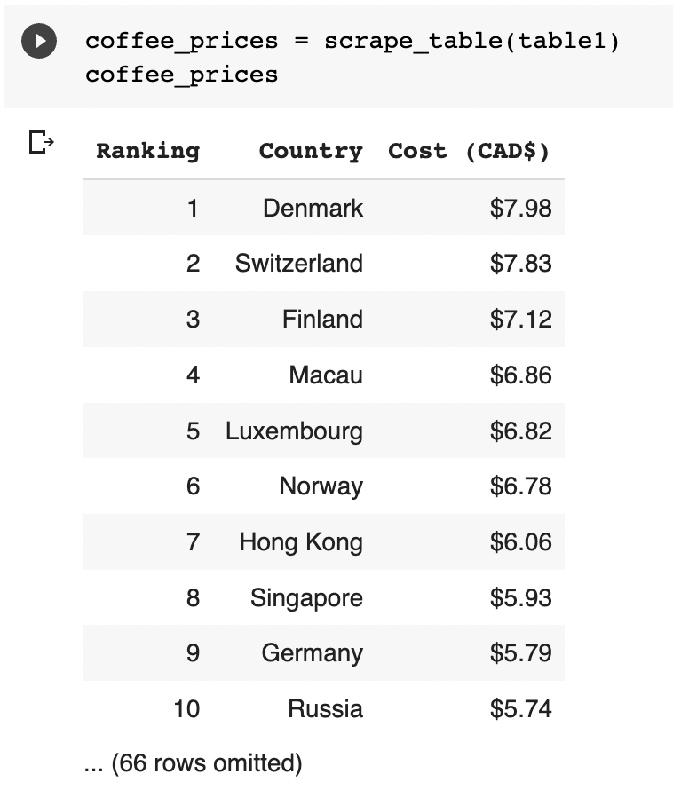
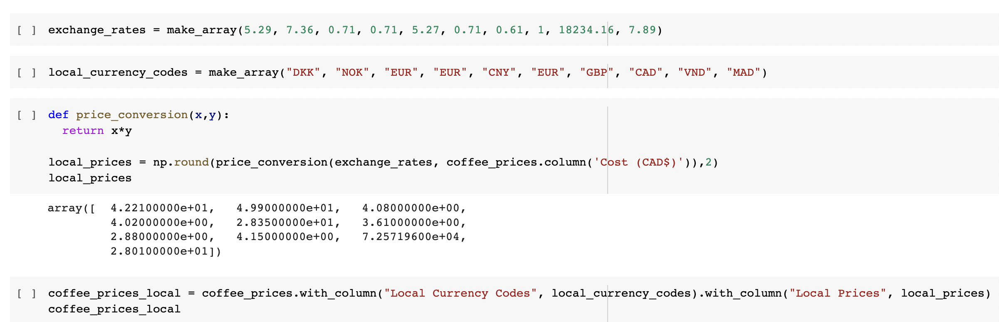
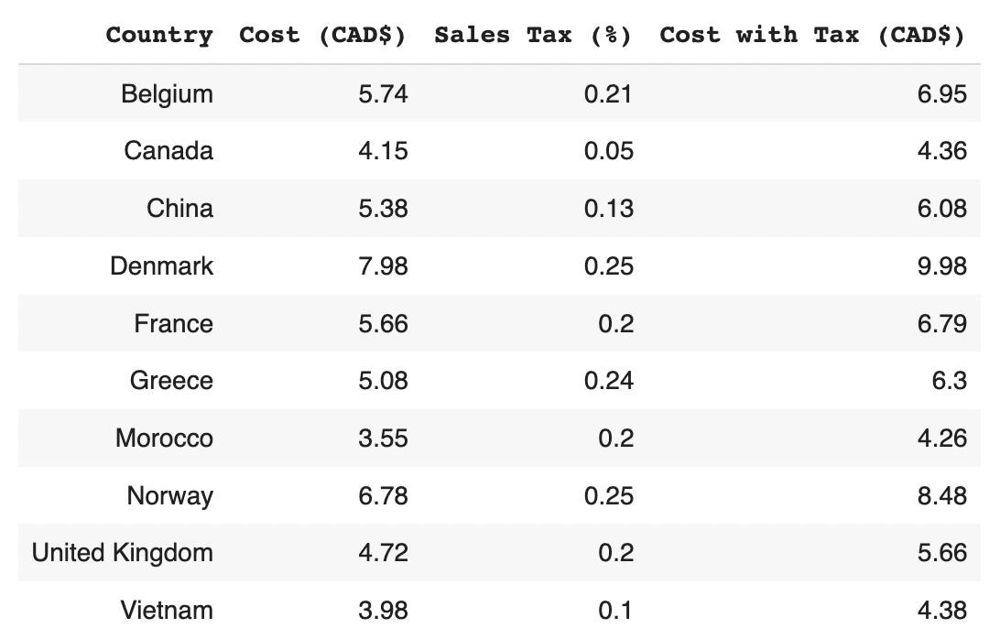

# Starbucks Index

### The Starbucks Tall Latte

Starbucks can be considered iconic as it is one of the most recognizable coffee stores in the world. With over 35,000 stores in 80 different countries, Starbucks has distinguished itself as one of the world’s most successful companies in the coffee industry. For this project to be successful, it is important that the product chosen is identical wherever you go. Starbucks is known for altering their menu to better appeal to the country they are in however one item that is the same everywhere you go is the Starbucks Tall Latte. A simple drink recognized and loved by coffee fanatics on a global scale!

## Bulding my Index:

### 1. Finding my data and using web scraping to import it

I was able to find pricing data on Starbucks tall lattes around the world through this website, https://www.finder.com/ca/starbucks-index. The website essentially had the prices of a tall latte in 76 different countries all displayed in a table. After a simple scrape I had my pricing data and was ready to start tidying up.

### My data:

### 2. Tidying up my data

My data was not in need of much cleaning however it still needed work. The first thing I did was select only 10 countries out of the 76 as this was the requirement. I selected 10 rows simply by using the ‘take’ command and ensuring that Canada was a part of the selected countries. I kept all this data in a table called ‘coffee_prices.’

I then needed to convert the prices into floats (numbers) from string seeing that they were displayed with a currency sign ($10.23). To do this I defined a function that uses the command ‘strip’ to get rid of the currency sign and leave me with the prices as numbers. All I needed to do was apply this function to the column ‘prices’ in my table. This is important as I will later be manipulating these prices, and this can only be done if they are numbers. 

This was practically all the tidying up my data needed. I am now ready to start using this data to create my index!

### 3. Displaying local prices and currency codes

As part of the assignment, I needed to display the prices in different countries in their respective currencies. Since I already had the prices in CAD I needed to work back from there. I first gathered the exchange rates for the 10 chosen countries and created an array for them. I also created an array with all currency codes of the chosen countries. I then defined a function that simply multiplies 2 given elements, in this case it would be the price in CAD multiplied by the exchange rate of the respective country. I created a new table called ‘coffee_prices_local’ in which I brought everything together. I had 4 columns which were ‘Country’, ‘Price (CAD)’, ‘Local Currency Codes’ and ‘Local Price.’ The table displayed the 10 countries with the price of a tall latte in CAD as well as in their local prices.

### 4. Importing tax rate data to factor into my calculations

As a bonus I decided to factor local tax rates into my calculations. I found a site that provides information on Sales Tax, Corporate Tax, and Income tax for 151 countries. 

The data needed some quick cleaning for it to be useful. I started by using the ‘take’ command to select only the 10 countries I was working with. I then dropped the columns I didn’t need, for my case I will only be looking at sales tax rates as that is what is charged when purchasing a good or service. The next step was to apply a lambda function that divides the values by 100 which I did to attain the rates in decimal form. This will make it easier for me to incorporate the rates into the prices. I kept this tax data in a table called ‘tax_rate.’

After cleaning up the data it was time to use it. I started by joining the tables tax_rate and coffee_prices using the ‘join’ function and called my new table coffee_prices_tax. This gave me a cleaned-up table with all the information I need at this point. 

Now for the calculations! Once again I defined a function that takes 2 elements (x,y). The function would multiply x and y then add x to the result. In context I am multiplying the prices by the tax rate to calculate how much is paid in tax. The I am adding that result back to the original price to obtain the prices with tax factored in. I add a column to my table and title it ‘Cost with tax (CAD$).'

### 5. Finding the countries that sell the cheapest tall latte and the countries that sell the most expensive latte

To find the differences in pricing between the countries in comparison to Canada all I really needed to do was apply a lambda function. The function would take a value (x) and take away 4.36 which was the cost of a tall latte with tax in Canada. This would give me this difference in prices of all the countries in comparison to Canada. I took these values and added them to my table in a column titled ‘Difference in Prices (CAD$).'

### 6. Graphing and analyzing my data

For a better visual representation, I graphed my findings using a bar chart with the tbl.barh method. I had the differences in prices on the x-axis and the countries on the y-axis. 

From this graph it becomes quite evident as to which countries have the highest prices and which countries have the lowest when compared to Canadas prices. If your visiting Denmark from Canada I would recommend staying away from Starbucks seeing that it is the most expensive place to buy a Starbucks tall latte and you’d an extra $5.62 for the same product. In contrast, Morocco has the cheapest price out of the 10 countries so buying a tall latter from there essentially saves you 10 cents. Not that much but still cheaper!

