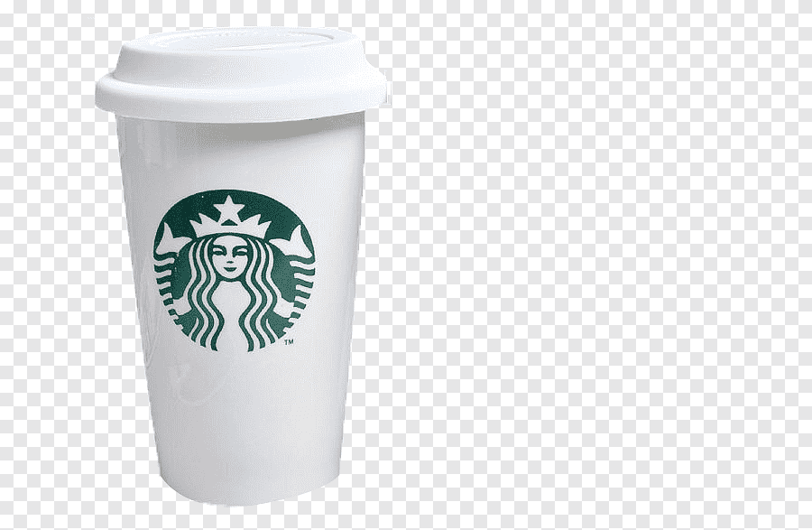

# Starbucks Index

### The Starbucks Tall Latte

Starbucks can be considered iconic as it is one of the most recognizable coffee stores in the world. With over 35,000 stores in 80 different countries, Starbucks has distinguished itself as one of the world’s most successful companies in the coffee industry. For this project to be successful, it is important that the product chosen is identical wherever you go. Starbucks is known for altering their menu to better appeal to the country they are in however one item that is the same everywhere you go is the Starbucks Tall Latte. A simple drink recognized and loved by coffee fanatics on a global scale.!

